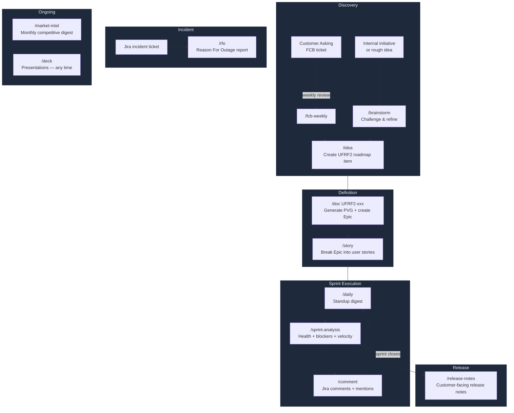

# Unifonic AI Product Ops

An AI-powered Product Operations framework for PMs at Unifonic. Automates daily PM workflows — standups, user stories, release notes, documentation, incident reports, and sprint analysis — through slash commands connected live to Jira and Confluence.

---

## What It Does

You run slash commands in Claude Code. The AI reads your squad's Jira sprint, writes the output, and asks for your approval before pushing anything to Confluence or Jira.

No fabrication — everything is grounded in live Atlassian data.

---

## PM Command Flow

Each command maps to a phase of the product lifecycle. Use this as a guide for when to run what.



> **Tip:** `/brainstorm` → `/idea` → `/doc` → `/story` is the standard path for any new feature. Run `/sprint-analysis` mid-sprint to catch issues before they become blockers.

---

## Commands

### `/daily` — Daily Standup Digest

Combines a Copilot meeting summary with live Jira sprint data into a structured digest.

**Usage:**

```
/daily

[Paste your Copilot meeting summary here]
```

Or skip the meeting summary and pull from Jira only:

```
/daily skip
```

You can pass your squad key to skip the prompt: `/daily CB` or `/daily PMRKT skip`

**Output:** Sprint progress table, blockers, decisions made, action items, items needing PM decision. Optionally pushed to Confluence Sprint Reviews.

---

### `/story` — User Story Generator

Turns a feature description into a properly formatted user story with acceptance criteria and a story point estimate. Optionally creates the ticket in Jira and sets the requested initial status.

**Usage:**

```
/story Allow marketing managers to schedule WhatsApp campaigns in advance with timezone-aware delivery
```

```
/story
The CDP should support RFM segmentation so clients can target their highest-value customers automatically
```

You can prefix with your squad key: `/story CB Allow agents to snooze conversations`

**Output:** As a / I want / So that + Given/When/Then acceptance criteria + DoD checklist + story points + dependencies. Pushed to Jira on approval.

---

### `/sprint-analysis` — Sprint Analysis Report

Scans the active sprint for stale, blocked, unassigned, and overdue tickets. Flags DoR and DoD violations. Optionally drafts follow-up messages for the team.

**Usage:**

```
/sprint-analysis
```

```
/sprint-analysis p0
```

(focus on P0 and P1 items only)

You can pass your squad key: `/sprint-analysis CB` or `/sprint-analysis CB p0`

**Output:** Tables of stale tickets, blockers, unassigned items, overdue work, and recommended actions.

---

### `/release-notes` — Release Notes Generator

Pulls all Done tickets from the last completed sprint, categorizes them, and generates customer-facing release notes. Pushed to Confluence on approval.

**Usage:**

```
/release-notes
```

```
/release-notes sprint 14
```

**Output:** What's New, Why It Matters, Who Is Affected, Known Issues, Coming Next — in Unifonic release note format.

---

### `/brainstorm` — Feature Brainstorm & Idea Refinement

Challenges a PM's idea or problem statement before it enters the roadmap. Stress-tests the business case (revenue/adoption impact), leads with weaknesses, and forces explicit trade-offs across 2–4 approaches. Designed to make sure ideas are grounded in business outcomes — not just technical solutions.

**Usage:**

```
/brainstorm How should we handle audience deduplication in MCC?
```

```
/brainstorm We want to let agents see customer journey history inside Agent Console
```

```
/brainstorm PMRKT — best approach for surfacing RFM scores in campaign builder
```

**Output:** Business case check + approaches table (with biggest risk per approach) + recommended direction + why it could still fail + next step (`/idea`, `/story`, or `/doc`).

---

### `/idea` — Create a Roadmap Item

Creates a new idea directly in the Unifonic Internal Roadmap (UFRF2) without going through the FCB customer asking flow. Useful for internally-generated initiatives, strategic bets, or tech investments.

The command enforces a **mandatory business-language description** (value proposition, use cases, key functionalities) and checks whether the idea is a **Top Feature**:

- **Top Feature = Yes** — PVG is mandatory. The command collects full detail upfront, generates the PVG, and attaches the Confluence link back to the UFRF2 item automatically.
- **Top Feature = No** — PVG is optional, offered at the end of the flow.

Collects all mandatory fields interactively: Category, Product Area, Feature Type, Status, Project Start, and Delivery Date. Presents a full draft for PM approval before writing anything.

**Usage:**

```
/idea Customers want to receive SMS delivery receipts in real time via webhook with retry support
```

```
/idea Add support for scheduled outbound IVR campaigns triggered from Flow Studio
```

**Output:** UFRF2 idea created with all required fields and business description populated. If Top Feature: Epic on squad board + PVG published to Confluence + PVG link attached to the UFRF2 item.

---

### `/fcb-weekly` — Customer Askings Weekly Review

Runs a weekly review over the Customer Askings board (`FCB`) using a Friday-to-Friday UAE window by default. It classifies askings into `Roadmap candidate`, `Needs info`, `Duplicate likely`, and `Not now`, then proposes next actions.

Before publishing, it asks the PM to choose summary destination:
- Confluence page, or
- local markdown file in `outputs/`.

For roadmap candidates, the command connects directly to existing execution flow:
- default handoff: `/idea` (refine/create roadmap item),
- if already ready in UFRF2: `/doc UFRF2-xxx`.

**Usage:**

```
/fcb-weekly
```

Optional custom window:

```
/fcb-weekly 2026-02-20..2026-02-27 Asia/Dubai
```

**Output:** Executive summary + recommendation table + missing info queue + explicit `/idea` and `/doc` handoff list. No automatic status changes.

---

### `/comment` — Add Jira Comment + Tag People

Adds a comment to any Jira issue and optionally tags one or more people using valid Jira mentions (`accountId`-based), not fragile plain `@name` text.

**Usage:**

```
/comment UFRF2-666 tagging works now
```

```
/comment CB-123 Please review this before grooming tomorrow
```

You can also pass a full issue URL:

```
/comment https://unifonic.atlassian.net/browse/CB-123 Please review this before grooming tomorrow
```

**Output:** Comment posted on the target issue. If tags are requested, users are resolved to account IDs and mentioned correctly. Requires PM approval before write.

---

### `/doc` — Feature Documentation & PVG Generator

Two modes depending on the input:

**PVG Mode** — pass a `UFRF2-xxx` key or URL. Triggered when a customer asking has been promoted to the Unifonic roadmap. Fetches the roadmap item, generates a full PVG, creates an Epic on the squad board, links it back to the roadmap item, and publishes the PVG to Confluence.

```
/doc UFRF2-677
```

```
/doc https://unifonic.atlassian.net/browse/UFRF2-677
```

**Output:** PVG published to Confluence (UPP > PVG > [Squad]) + Epic created on squad board titled `[Customer Asking] Feature Name` + Polaris work item link connecting Epic → UFRF2 + Confluence link added as comment on both tickets. Requires PM approval before any writes.

---

**Feature Doc Mode** — pass a squad ticket ID, squad key, or plain description. Generates a user-facing documentation article.

```
/doc PMRKT-142
```

```
/doc WhatsApp campaign scheduling
```

**Output:** Overview, User Personas, How It Works, Configuration, Edge Cases, FAQs — ready to publish to Confluence.

---

### `/rfo` — Reason For Outage

Pulls data from a Jira incident or RCA ticket and drafts a structured RFO document. Published to Confluence and linked back to the Jira ticket on approval.

**Usage:**

```
/rfo PMRKT-51
```

**Output:** RFO document with General Information, What Happened, Root Cause, Resolution, and Corrective Actions. Requires PM approval before publishing.

---

### `/market-intel` — Competitive Intelligence Digest

Runs a monthly competitive intelligence scan across 4 competitor layers using Anthropic web search. Covers the past 30 days of activity and outputs a branded Word document.

**Layers covered:**

| Layer | Competitors |
|---|---|
| CPaaS & Channels | Twilio, Infobip, Sinch, MessageBird, T2 (STC) |
| Agentic Marketing & Campaign Orchestration | Braze, MoEngage, WebEngage, CleverTap, Insider |
| AI Customer Care & CCaaS | Intercom, Zendesk, Genesys, Salesforce Service Cloud, Freshworks |
| MENA & Regional Players | Wati, STC, Zain, Mobily, Taqnyat |
| MENA & Industry Signals | GCC/MENA market signals, regulatory updates, funding rounds |

**Prerequisites:** `ANTHROPIC_API_KEY` in `.env` + `pip3 install -r requirements.txt`

**Usage:**

```
/market-intel
```

**Output:** `intel/YYYY-MM-DD_HHMM.docx` — branded Word document with Unifonic colors, competitor sections, clickable source links, and MENA signals. Recommended cadence: monthly.

---

### `/deck` — Presentation Deck Generator

Builds a complete, on-brand Unifonic `.pptx` presentation using the official design system and positioning language. Two modes: `customer` (sales/exec-facing) and `enablement` (technical support/pre-sales). Optionally fetches content directly from a Confluence PVG page to populate slides.

Deck generation is template-first and uses `./New positioning unifonic.pptx` as the base theme/master.

**Arguments:**

| Argument | Description | Required | Default |
|---|---|---|---|
| `type` | `customer` or `enablement` | Yes | — |
| `topic` | What the deck is about | Yes | — |
| `confluence URL` | Link to a Confluence PVG page | No | — |
| `image refs` | Comma-separated image keys or filenames from `assets/deck/images` | No | — |
| `slides` | Target slide count | No | `customer` = 8, `enablement` = 10 |

**Usage:**

Both `customer` and `enablement` decks accept an optional Confluence PVG URL. When provided, content is pulled live from the PVG page and mapped to each slide. You can also pass a topic description only — the command will build from positioning language and your input.

Optional image assets:
- Place images in `assets/deck/images`
- Optionally define key aliases in `assets/deck/images/manifest.yml`
- Reference keys or filenames in the `/deck` prompt

```
/deck customer RFM Segmentation — enterprise retail prospects — https://unifonic.atlassian.net/wiki/spaces/UPP/pages/123456789/RFM+PVG
```

```
/deck customer Agentic Care Solution — insurance vertical C-suite — 8 slides
```

```
/deck enablement TikTok Messaging — technical support teams — 10 slides
```

```
/deck enablement Call Recording Insights — pre-sales engineers — https://unifonic.atlassian.net/wiki/spaces/UPP/pages/3209199631/PVG+-+Voice+Call+Recording+Insights
```

**Output:** A `.pptx` file saved to `./outputs/[topic-slug].pptx`. The command shows a slide-by-slide plan and asks for approval before building.

**Deck types:**

- `**customer`** — 8 slides. Business outcome-focused. No internal jargon, no API names. Anchored to Agentic CX narrative. Accepts a Confluence PVG URL or topic description. Used in sales calls, demos, and executive briefings.
- `**enablement**` — 10 slides. Technical and precise. Includes config details, API endpoints, feature flags, known limitations, and escalation paths. Accepts a Confluence PVG URL or topic description. Used by pre-sales engineers and technical support teams.

---

### `/slavic-mode` — PM Response Compression

Reduces agent output tokens by 50-65% by tightening prose, abbreviating standard PM fields, and removing structural padding. Does not change data — changes how much text wraps it.

Four modes control how deep compression goes:

| Mode | What gets compressed |
|------|---------------------|
| `light` | Conversational responses only |
| `jira` | Conversation + Jira artifacts (descriptions, AC, comments) |
| `wiki` | Conversation + Confluence artifacts (pages, release notes, PVGs) |
| `full` | Conversation + Jira + Confluence artifacts |

**Usage:**

```
/slavic-mode          # light mode — conversation only
/slavic-mode full     # compress everything
/slavic-mode jira     # conversation + Jira artifacts
/slavic-mode wiki     # conversation + Confluence artifacts
/slavic-mode off      # disable
```

**What it compresses:**
- Preamble and trailing pleasantries removed
- Sprint tables narrowed to Key | Title | Status | Owner
- AC condensed: `[context] → [action] → [result]` per line
- Confluence page intros and Overview sections removed
- Competitor entries in market intel capped at 2 bullets each
- Empty table columns dropped silently

**Never compressed regardless of mode:** RFO documents, drafts shown for PM approval before Jira/Confluence writes.

Stays active for the whole session. Re-run to switch mode or turn off.

---

## Squads Configured


| Squad                       | Jira Key | PM                              | Products                                        |
| --------------------------- | -------- | ------------------------------- | ----------------------------------------------- |
| Campaigns & CDP             | PMRKT    | Kamal Chidirala                 | MCC, Audience, Smart Links (uLink)              |
| Business Messaging          | CON      | Ogechi Wosu                     | WhatsApp, Email, Push                           |
| SMS Unified                 | SMS      | David Barajas, Muhammad Tanveer | SMS Gateway, Webhook, API v1/v2, Spike Detector |
| Voice                       | VC       | Kayode Adebowale                | Voice Calls, IVR, CCaaS                         |
| Flow Studio & Integrations  | JO       | Olushola Oluyomi                | Flow Studio, Integrations                       |
| Agent Console               | CB       | Berina Halilovic                | Agent Console                                   |
| Conversational AI (Chatbot) | AIS      | Jessica Isah                    | AI Chatbot Builder                              |
| Agentic CX                  | ACX      | Jessica Isah                    | Agentic Framework, Campaign Agents, MCP Tools      |
| UC Platform                 | UCCC     | Nourelding Abdelaal               | UC Console, Billing & Charging, Data & Reporting   |
| Data Engineering            | DENG     | Maged Boutros                             | Data Platform, Reporting APIs, Data & Reporting UC |
| Customer Insights           | CI       | Maged Boutros                      | UC Console, Billing & Charging, Data & Reporting   |


Squad configs live in `squads/*.md`. Each file contains team members, products owned, active epics, sprint snapshot, Jira/Confluence config, DoR, DoD, and squad vocabulary.

---

## Setup

### Step 1 — Install Claude Code

Download and install Claude Code from [claude.ai/code](https://claude.ai/code). Sign in with your Anthropic account.

### Step 2 — Connect Atlassian (Jira + Confluence)

1. Go to [claude.ai](https://claude.ai) → **Settings** → **Integrations**
2. Find **Atlassian** and click **Connect**
3. Sign in with your Unifonic Atlassian account and authorize access to Jira and Confluence
4. Once connected, the integration is available in all Claude Code sessions

### Step 3 — Clone and Open the Project

```bash
git clone https://github.com/anridev/claude-code-pm.git
cd claude-code-pm
claude .
```

### Step 4 — Verify the Connection

In Claude Code, run:

```
/mcp
```

You should see **claude.ai Atlassian** listed as a connected integration. If it is not listed, return to Step 2.

---

## Getting Started

Once set up, the recommended first commands are:

| Goal | Command |
|---|---|
| See your squad's sprint status | `/daily skip` |
| Generate a user story | `/story [describe the feature]` |
| Check for blockers and stale tickets | `/sprint-analysis` |
| Challenge and refine an idea | `/brainstorm [idea or problem]` |
| Add a new idea to the roadmap | `/idea [describe the feature]` |
| Run customer askings weekly review | `/fcb-weekly` |
| Add a Jira comment and tag people | `/comment ISSUE-123 [comment text]` |
| Turn a roadmap item into an Epic + PVG | `/doc UFRF2-xxx` |
| Build a customer-facing deck | `/deck customer [topic] — [confluence URL or description]` |
| Build a technical enablement deck | `/deck enablement [topic] — [confluence URL or description]` |
| Run monthly competitive intelligence | `/market-intel` |

All commands will ask which squad you're working for if it cannot be inferred. You can also pass your squad key directly:

```
/daily CB
/sprint-analysis PMRKT
/story JO Add a new trigger type for webhook events
```

Available squad keys: `PMRKT` `CON` `SMS` `VC` `JO` `CB` `AIS` `ACX` `UCCC` `DENG` `CI`

---

## How It Works

1. You run a slash command in Claude Code
2. The AI reads your squad config from `squads/` to get Jira keys, Confluence pages, and team context
3. It queries Jira and/or Confluence live via the Atlassian MCP
4. It generates the output and presents it for your review
5. You approve — it pushes to Confluence or Jira
6. Nothing is written without your explicit approval

---

## Important Notes

- **Approval required** — every write to Jira or Confluence requires your explicit "approve" or confirmation
- **Squad context** — commands default to the squad configured in your current session. Specify a different squad with the Jira key if needed
- **Memory** — the po-employee agent maintains a memory file per session in `.claude/agent-memory/` to preserve context across sessions
- **DoR / DoD / Squad Vocabulary** — these sections in squad configs are never auto-updated; edit them manually
